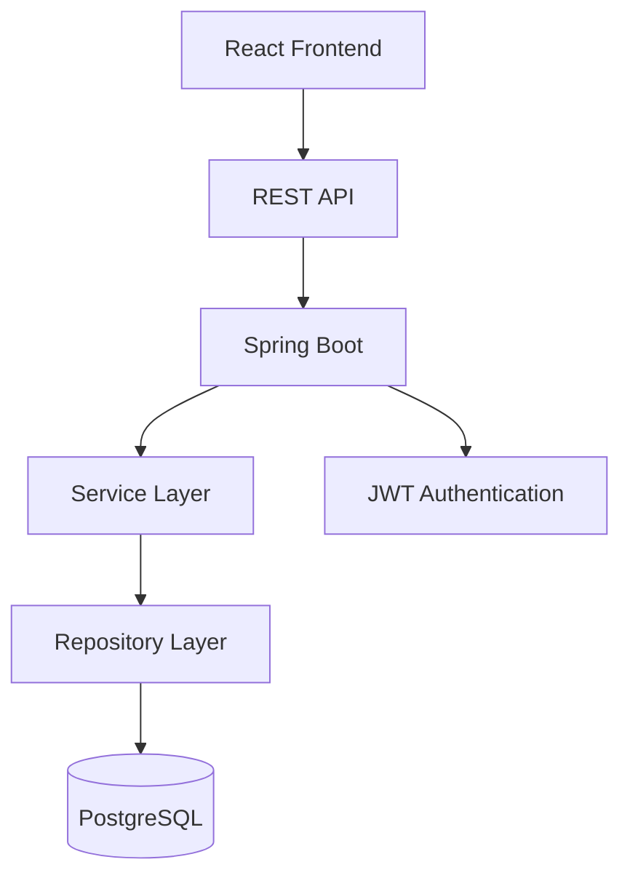

# DevFlow

> A modern full-stack project management platform for teams.

DevFlow is an enterprise-grade agile project management platform designed for software development teams to track projects, organize sprints, manage tasks on Kanban boards, analyze project metrics, and collaborate through comments and activity feeds.

---

## Overview

DevFlow provides a central workspace for managing the software development lifecycle. Key capabilities include:

- **Project Management**: Create, configure, update, and track software projects with custom statuses (`PLANNING`, `ACTIVE`, `COMPLETED`, `ARCHIVED`).
- **Role-Based Security & Permissions**: Server-side enforced project-level authorization (`OWNER`, `ADMIN`, `MEMBER`) and global user roles (`ADMIN`, `MEMBER`).
- **Sprint Management**: Plan sprints with goals, start/end dates, date validation, and status workflows (`PLANNED`, `ACTIVE`, `COMPLETED`).
- **Kanban Task Management**: Track tasks with priority levels (`LOW`, `MEDIUM`, `HIGH`, `URGENT`), due dates, assignee management, and status transitions (`TODO`, `IN_PROGRESS`, `IN_REVIEW`, `DONE`).
- **Team Collaboration & Members**: Search users, assign project membership, view member activity profiles, and prevent project owner removal.
- **Threaded Discussion Comments**: Issue-level comment discussions with author tracking and strict ownership modification rules.
- **Activity Streams & Notifications**: Real-time project activity logs and targeted notifications for task assignments and team membership events.
- **Real-Time Project Analytics**: Live metric calculations for completion percentage, status distribution, overdue tasks, sprint progress, and member workload directly from PostgreSQL.

---

## Key Features

### Authentication & User Management
- User registration and login
- Password hashing with `BCryptPasswordEncoder`
- Stateless JWT authentication and token management
- User profile updates and password change
- Safe account deletion with complete foreign key cleanup

### Project Management
- Create, view, edit, and delete projects
- Project status tracking (`PLANNING`, `ACTIVE`, `COMPLETED`, `ARCHIVED`)
- Project ownership assignment and member management
- Project activity stream tracking

### Task & Issue Management
- Create, edit, view, and delete issues
- Task status transitions (`TODO`, `IN_PROGRESS`, `IN_REVIEW`, `DONE`)
- Priority classification (`LOW`, `MEDIUM`, `HIGH`, `URGENT`)
- Assign tasks to project members and sprints
- Personal assigned task dashboard (`/api/issues/my-assigned`)

### Sprint Management
- Create, edit, and delete project sprints
- Sprint status workflows (`PLANNED`, `ACTIVE`, `COMPLETED`)
- Validation ensuring sprint `endDate` is not prior to `startDate`
- Filter issues by sprint

### Collaboration
- Create, edit, and delete issue comments
- Comment ownership enforcement (authors and project admins only)
- Notification feed with unread count tracking (`/api/notifications`)
- Project activity history stream (`/api/projects/{id}/activity`)

### Real-Time Analytics
- Overall project completion percentage
- Task count breakdown by status and priority
- Active sprint count and sprint velocity
- Overdue tasks and unassigned issue metrics
- Member workload distribution

---

## Technology Stack

| Layer | Technology |
|---|---|
| **Frontend Framework** | React 18 (React Router DOM v7) |
| **Frontend Build Tool** | Vite 6 |
| **Styling** | Tailwind CSS |
| **Icons** | Lucide React |
| **HTTP Client** | Axios (with Bearer Token Interceptors) |
| **Backend Framework** | Spring Boot 4.1.1 (Java 21) |
| **Security Framework** | Spring Security (Stateless JWT Filter) |
| **Persistence / ORM** | Spring Data JPA / Hibernate |
| **Validation** | Jakarta Validation (`@NotBlank`, `@Size`, `@NotNull`) |
| **Database** | PostgreSQL |
| **Build Tool** | Maven (`mvnw` wrapper) |

---

## Architecture



### Layer Responsibilities
- **Frontend (React)**: Handles user interaction, client-side routing, state management, and renders responsive SaaS UI components.
- **Controllers (REST API)**: Exposes RESTful HTTP endpoints, parses DTO request payloads, and handles response mapping.
- **Service Layer**: Implements core business logic, domain validation rules, activity logging, and notification dispatching.
- **ProjectAuthorizationService**: Enforces server-side authority matrix across project owners, admins, and members.
- **Repositories (Data Layer)**: Handles JPA query execution, entity mapping, and database interaction.
- **Database (PostgreSQL)**: Stores users, projects, memberships, sprints, issues, comments, activities, and notifications.

### JWT Authentication Flow

```
User -> Login Request (email/password) -> AuthController -> AuthService -> BCrypt Verification
  -> JwtService generates signed JWT -> Returns Token to Frontend -> Stored in localStorage
  -> Subsequent Requests include 'Authorization: Bearer <token>' -> JwtAuthenticationFilter validates token
  -> SecurityContextHolder populated -> Controller/Service processes authorized request
```

---

## Project Structure

```
DevFlow/
├── frontend/
│   ├── public/
│   ├── src/
│   │   ├── api/
│   │   │   └── axios.js
│   │   ├── components/
│   │   │   ├── CommentSection.jsx
│   │   │   ├── KanbanBoard.jsx
│   │   │   ├── Navbar.jsx
│   │   │   ├── ProjectModal.jsx
│   │   │   └── ...
│   │   ├── context/
│   │   │   └── AuthContext.jsx
│   │   ├── pages/
│   │   │   ├── Dashboard.jsx
│   │   │   ├── Login.jsx
│   │   │   ├── Profile.jsx
│   │   │   ├── ProjectDetail.jsx
│   │   │   ├── Projects.jsx
│   │   │   └── Register.jsx
│   │   ├── App.jsx
│   │   └── main.jsx
│   ├── .env.example
│   ├── package.json
│   ├── tailwind.config.js
│   └── vite.config.js
│
├── src/
│   └── main/
│       ├── java/
│       │   └── com/devflow/ai/
│       │       ├── controller/
│       │       │   ├── AuthController.java
│       │       │   ├── CommentController.java
│       │       │   ├── HealthController.java
│       │       │   ├── IssueActivityController.java
│       │       │   ├── IssueController.java
│       │       │   ├── NotificationController.java
│       │       │   ├── ProjectActivityController.java
│       │       │   ├── ProjectController.java
│       │       │   ├── SprintController.java
│       │       │   └── UserController.java
│       │       ├── dto/
│       │       │   ├── ApiErrorResponse.java
│       │       │   ├── IssueDTO.java
│       │       │   ├── ProjectDTO.java
│       │       │   └── ...
│       │       ├── exception/
│       │       │   ├── GlobalExceptionHandler.java
│       │       │   └── ...
│       │       ├── model/
│       │       │   ├── Comment.java
│       │       │   ├── Issue.java
│       │       │   ├── IssueActivity.java
│       │       │   ├── Notification.java
│       │       │   ├── Project.java
│       │       │   ├── ProjectActivity.java
│       │       │   ├── ProjectMember.java
│       │       │   ├── Sprint.java
│       │       │   └── User.java
│       │       ├── repository/
│       │       │   ├── UserRepository.java
│       │       │   └── ...
│       │       ├── security/
│       │       │   ├── JwtAuthenticationFilter.java
│       │       │   ├── JwtService.java
│       │       │   └── SecurityConfig.java
│       │       └── service/
│       │           ├── ProjectAuthorizationService.java
│       │           └── ...
│       └── resources/
│           ├── application.properties
│           └── application-prod.properties
│
├── .env.example
├── .gitignore
├── mvnw.cmd
├── pom.xml
└── README.md
```

---

## Database Design

### Implemented Entities & Purpose

| Entity / Table | Purpose |
|---|---|
| `users` | User account details, credentials, global roles, and bio |
| `projects` | Project workspaces, descriptions, ownership, and statuses |
| `project_members` | Project membership associations and project-specific roles (`OWNER`, `ADMIN`, `MEMBER`) |
| `sprints` | Project sprint iterations with goals and start/end dates |
| `issues` | Tasks/issues assigned to projects, assignees, and sprints |
| `comments` | Threaded discussions linked to specific issues |
| `notifications` | Targeted user notifications for task assignments and project events |
| `issue_activities` | Audit trail for issue-specific events |
| `project_activities` | Project-level activity feed entries |

### Entity Relationships
- **User (1) → (N) Projects** (Project Owner)
- **User (1) → (N) Project Members (N) ← (1) Project** (Many-to-Many membership link)
- **Project (1) → (N) Sprints**
- **Project (1) → (N) Issues**
- **Sprint (1) → (N) Issues** (Optional association)
- **User (1) → (N) Assigned Issues** (Optional assignment)
- **Issue (1) → (N) Comments**
- **User (1) → (N) Notifications**

---

## Authentication & Security

- **Password Storage**: Passwords are encrypted using `BCryptPasswordEncoder` before database persistence. Passwords are annotated with `@JsonIgnore` and never serialized in API responses.
- **JWT Authorization**: Requests to protected `/api/**` endpoints must provide `Authorization: Bearer <JWT_TOKEN>`.
- **Backend Authority**: Security checks are strictly validated server-side by `ProjectAuthorizationService`. Hidden UI elements never replace backend security logic.
- **Exception Protection**: Production errors suppress raw stack traces and internal SQL details, returning standard `ApiErrorResponse` JSON.

---

## Roles & Permissions

### Global User Roles
- `ADMIN`: Platform administrator privileges.
- `MEMBER`: Standard user account.

### Project-Level Roles

| Role | View Workspace | Edit Project | Add/Remove Members | Manage Sprints | Create/Edit Tasks | Delete Task | Edit Comment |
|---|:---:|:---:|:---:|:---:|:---:|:---:|:---:|
| **Project Owner** | ✅ | ✅ | ✅ (Excluding Owner) | ✅ | ✅ | ✅ | Author Only |
| **Project Admin** | ✅ | ✅ | ✅ (Excluding Owner) | ✅ | ✅ | ✅ | Author Only |
| **Project Member** | ✅ | ❌ | ❌ | ❌ | ✅ | Creator/Assignee | Author Only |
| **Non-Member** | ❌ (403) | ❌ (403) | ❌ (403) | ❌ (403) | ❌ (403) | ❌ (403) | ❌ (403) |

---

## API Overview

### Health Check
- `GET /api/health` - Unauthenticated system health check (`{"status": "UP"}`)

### Authentication (`/api/auth`)
- `POST /api/auth/register` - Register new user account
- `POST /api/auth/login` - Authenticate user credentials & receive JWT
- `GET /api/auth/me` - Fetch currently authenticated user profile

### User Profile (`/api/users`)
- `GET /api/users/search` - Search users by name or email query
- `GET /api/users/me` - Get profile of current user
- `GET /api/users/{id}` - Fetch user by ID
- `PUT /api/users/me` - Update profile metadata
- `PUT /api/users/me/password` - Change account password
- `DELETE /api/users/me` - Delete account & clean up user data

### Projects (`/api/projects`)
- `GET /api/projects` - List projects accessible by current user
- `POST /api/projects` - Create a new project
- `GET /api/projects/{id}` - Fetch project workspace details
- `PUT /api/projects/{id}` - Update project details
- `DELETE /api/projects/{id}` - Delete project workspace
- `GET /api/projects/{id}/analytics` - Fetch project analytics metrics
- `GET /api/projects/{id}/activity` - Fetch project activity stream log

### Project Members (`/api/projects/{id}/members`)
- `GET /api/projects/{id}/members` - Get list of project members
- `GET /api/projects/{id}/available-members` - Search non-member users for invite
- `GET /api/projects/{id}/members/{userId}/profile` - Get member workload profile
- `POST /api/projects/{id}/members` - Add user to project
- `DELETE /api/projects/{id}/members/{userId}` - Remove member from project

### Sprints (`/api/projects/{projectId}/sprints` & `/api/sprints`)
- `GET /api/projects/{projectId}/sprints` - List project sprints
- `POST /api/projects/{projectId}/sprints` - Create new sprint
- `PUT /api/sprints/{id}` - Update sprint details/status
- `DELETE /api/sprints/{id}` - Delete sprint

### Issues (`/api/projects/{projectId}/issues` & `/api/issues`)
- `GET /api/projects/{projectId}/issues` - List issues in project
- `POST /api/projects/{projectId}/issues` - Create new issue
- `GET /api/sprints/{sprintId}/issues` - List issues in sprint
- `GET /api/issues/my-assigned` - Get tasks assigned to logged in user
- `GET /api/issues/{id}` - Get issue details
- `PUT /api/issues/{id}` - Update issue details
- `PATCH /api/issues/{id}/status` - Transition issue status
- `DELETE /api/issues/{id}` - Delete issue

### Comments (`/api/issues/{issueId}/comments` & `/api/comments`)
- `GET /api/issues/{issueId}/comments` - List comments for issue
- `POST /api/issues/{issueId}/comments` - Create issue comment
- `PUT /api/comments/{id}` - Update comment content
- `DELETE /api/comments/{id}` - Delete comment

### Notifications (`/api/notifications`)
- `GET /api/notifications` - List user notifications
- `GET /api/notifications/unread-count` - Get unread notification count
- `PATCH /api/notifications/{id}/read` - Mark notification as read
- `PATCH /api/notifications/read-all` - Mark all notifications as read

---

## API Authentication

Protected API requests require a valid Bearer token header:

```http
Authorization: Bearer <JWT_TOKEN>
```

*(Replace `<JWT_TOKEN>` with the token returned by `/api/auth/login` or `/api/auth/register`.)*

---

## Environment Variables

### Backend Environment Variables

| Variable | Description | Default / Example |
|---|---|---|
| `SPRING_PROFILES_ACTIVE` | Active Spring configuration profile | `prod` (or default) |
| `DATABASE_URL` | PostgreSQL JDBC connection URL | `jdbc:postgresql://localhost:5432/devflow` |
| `DATABASE_USERNAME` | Database username | `postgres` |
| `DATABASE_PASSWORD` | Database password | `your_secure_password` |
| `PORT` | Server HTTP port | `8080` |
| `JWT_SECRET` | 256-bit JWT signing key | `your_super_secret_jwt_signing_key` |
| `JWT_EXPIRATION_MS` | Token expiration duration in ms | `86400000` (24 Hours) |
| `FRONTEND_URL` | Dynamic CORS allowed origins (Comma-separated) | `http://localhost:3000` |

### Frontend Environment Variables

| Variable | Description | Default / Example |
|---|---|---|
| `VITE_API_URL` | Base API URL | `/api` (or `https://api.yourdomain.com/api`) |

---

## Prerequisites

- **Java Development Kit**: Java 21 JDK
- **Node.js & npm**: Node.js v18+ and npm v9+
- **Database Engine**: PostgreSQL 14+
- **Build Tool**: Maven 3.8+ (wrapper included)

---

## Local Development Setup

### 1. Database Setup
Create a PostgreSQL database named `devflow`:
```sql
CREATE DATABASE devflow;
```

### 2. Backend Startup
From the project root directory, launch the Spring Boot application:

```bash
# Windows PowerShell
.\mvnw.cmd spring-boot:run

# Linux / macOS
./mvnw spring-boot:run
```
The backend server runs at `http://localhost:8080`.

### 3. Frontend Startup
Navigate to the `frontend` folder, install dependencies, and start Vite:

```bash
cd frontend
npm install
npm run dev
```
Open your browser at `http://localhost:3000`.

---

## Frontend & Backend Commands

### Frontend Commands (`frontend/`)
- `npm install`: Install dependencies
- `npm run dev`: Launch Vite development server
- `npm run build`: Execute production Vite compilation (`dist/`)
- `npm run preview`: Preview production build locally

### Backend Commands (Root)
- `.\mvnw.cmd spring-boot:run`: Run backend server locally
- `.\mvnw.cmd test`: Run backend unit and integration test suite (20 tests)
- `.\mvnw.cmd clean package -DskipTests`: Compile production executable JAR (`target/demo-0.0.1-SNAPSHOT.jar`)

---

## Typical Application Workflow

```
User Registration / Login
        ↓
Create Project Workspace
        ↓
Add Team Members to Project
        ↓
Create Sprints with Goals & Dates
        ↓
Create Tasks & Assign to Members & Sprints
        ↓
Move Tasks on Kanban Board (TODO -> IN_PROGRESS -> IN_REVIEW -> DONE)
        ↓
Collaborate via Discussion Comments
        ↓
Receive System Notifications & View Activity Stream
        ↓
Monitor Live Project Analytics & Velocity
```

---

## Error Handling & Status Codes

DevFlow uses a centralized `GlobalExceptionHandler` returning a standardized `ApiErrorResponse` JSON payload:

| Status Code | Reason | Description |
|:---:|---|---|
| `400 Bad Request` | Validation Failed | Input validation errors, invalid dates, or malformed JSON |
| `401 Unauthorized` | Unauthorized | Missing or expired JWT token |
| `403 Forbidden` | Forbidden | Unauthorized action or insufficient project permissions |
| `404 Not Found` | Not Found | Target project, issue, sprint, user, or resource does not exist |
| `409 Conflict` | Conflict | Duplicate member addition or unique constraint violation |
| `500 Server Error` | Internal Error | Unexpected server error (stack trace concealed) |

---

## Testing

- **Backend Automated Unit & Integration Suite**: Execute `.\mvnw.cmd test` to run all 20 Spring Boot unit and integration tests (`CommentServiceTest`, `NotificationServiceTest`, `ProjectAnalyticsServiceTest`, `ProjectAuthorizationServiceTest`, `DemoApplicationTests`).
- **End-to-End API QA Sweep**: Automated PowerShell script (`qa_sweep.ps1`) executing 22 assertions verifying authentication, RBAC, IDOR protection, project workflows, notifications, analytics, and safe account deletion.

---

## Production Build

1. **Backend Package**:
   ```bash
   .\mvnw.cmd clean package -DskipTests
   ```
   Artifact output: `target/demo-0.0.1-SNAPSHOT.jar`.

2. **Frontend Package**:
   ```bash
   cd frontend
   npm run build
   ```
   Artifact output: `frontend/dist/`.

---

## Vercel (Frontend) + Render (Backend & PostgreSQL) Deployment Guide

### Architecture

```
User Browser ────► Vercel (React Frontend SPA)
                         │
                         ▼ HTTPS REST API / JWT
                   Render Web Service (Spring Boot)
                         │
                         ▼ JDBC Connection
                   Render PostgreSQL Database
```

### 1. Database Setup (Render PostgreSQL)
1. Log in to [Render Dashboard](https://dashboard.render.com/) and click **New +** → **PostgreSQL**.
2. Set Database Name: `devflow-db`, User: `devflow_admin`, Region: nearest region.
3. Once provisioned, note the **Internal Database URL**, **Database Name**, **User**, and **Password**.

### 2. Backend Deployment (Render Web Service)
1. Click **New +** → **Web Service** on Render and connect your GitHub repository.
2. Select Root Directory: `/` (or leave default).
3. Set Environment: **Java**.
4. Configure Build Command:
   ```bash
   ./mvnw clean package -DskipTests
   ```
5. Configure Start Command:
   ```bash
   java -jar target/demo-0.0.1-SNAPSHOT.jar --spring.profiles.active=prod
   ```
6. Add Environment Variables under **Environment**:
   - `SPRING_PROFILES_ACTIVE`: `prod`
   - `DATABASE_URL`: `jdbc:postgresql://<render-db-host>:5432/devflow-db`
   - `DATABASE_USERNAME`: `devflow_admin`
   - `DATABASE_PASSWORD`: `<render-db-password>`
   - `JWT_SECRET`: `<strong-256-bit-random-signing-secret>`
   - `FRONTEND_URL`: `https://<your-app-name>.vercel.app`
7. Click **Create Web Service**. Note your backend URL (e.g. `https://devflow-backend.onrender.com`).

### 3. Frontend Deployment (Vercel)
1. Log in to [Vercel Dashboard](https://vercel.com/) and click **Add New...** → **Project**.
2. Import your GitHub repository.
3. Set **Root Directory**: `frontend`.
4. Framework Preset: **Vite**.
5. Expand **Environment Variables** and add:
   - `VITE_API_URL`: `https://<your-render-backend-app>.onrender.com/api`
6. Click **Deploy**.
7. Vercel automatically deploys the frontend and applies SPA rewrites via `frontend/vercel.json`.

---

## Screenshots

Screenshots can be added here before final submission.

---

## Contributing

1. Create a feature branch (`git checkout -b feature/amazing-feature`)
2. Commit your changes (`git commit -m 'Add amazing feature'`)
3. Test locally (`.\mvnw.cmd test` and `npm run build`)
4. Push to branch and open a Pull Request

---

## License

License information has not yet been specified.

---

## Project Information

**DevFlow** — Modern full-stack agile project management platform.
